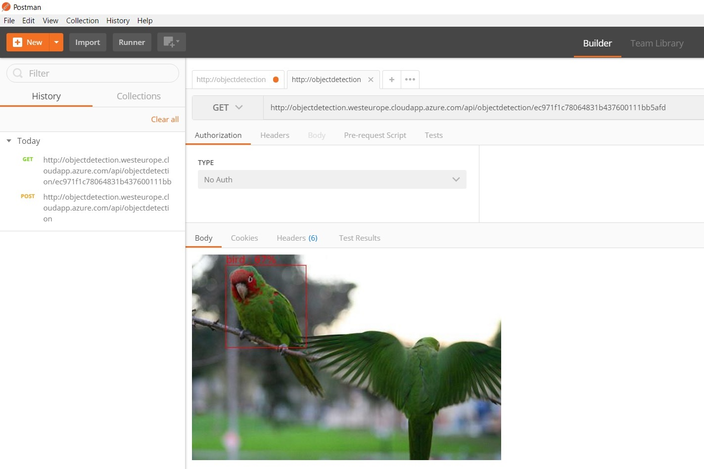

#  Simple Computer Vision Service on Azure

This project demostrates how to use ASP.NET Core, Tensorflow, TensorFlowSharp and Azure for building and deployment simple computer vision service.

Find more details in the [Code Project Article]()

